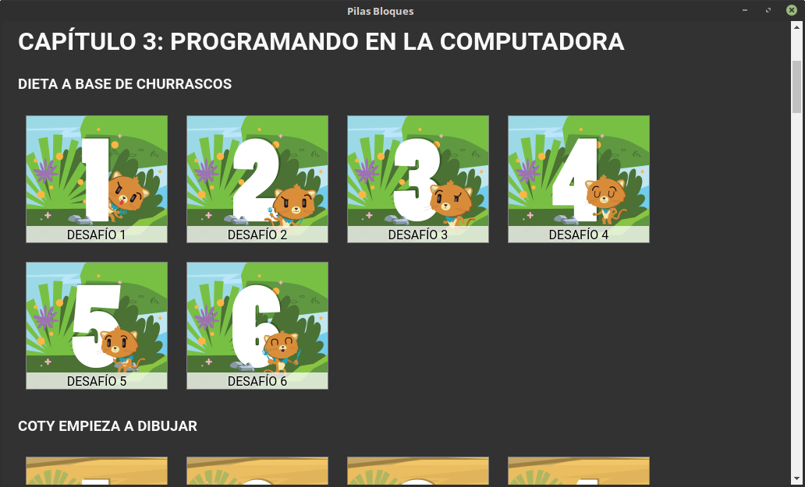
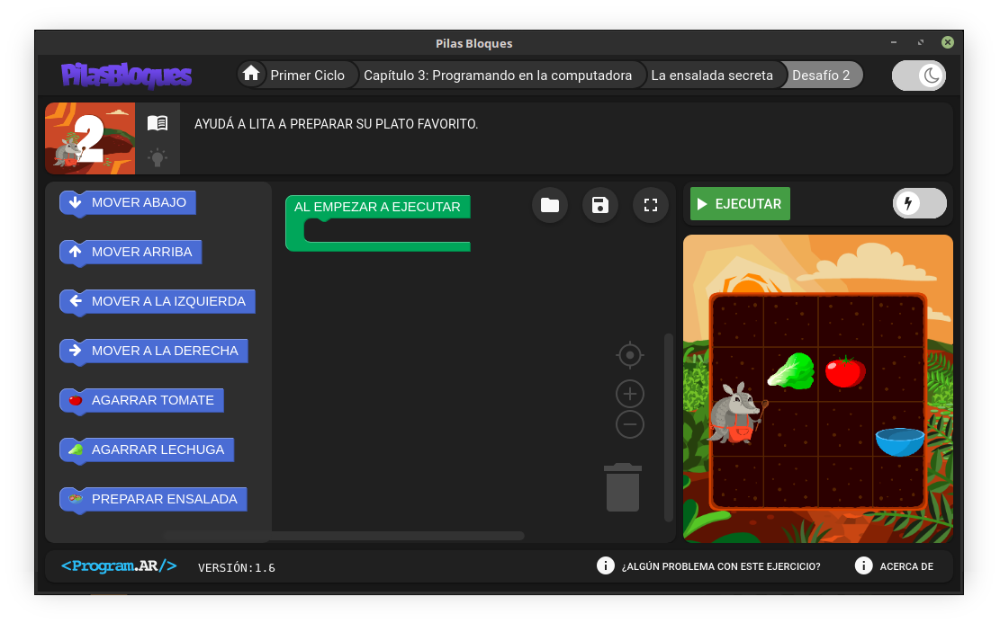
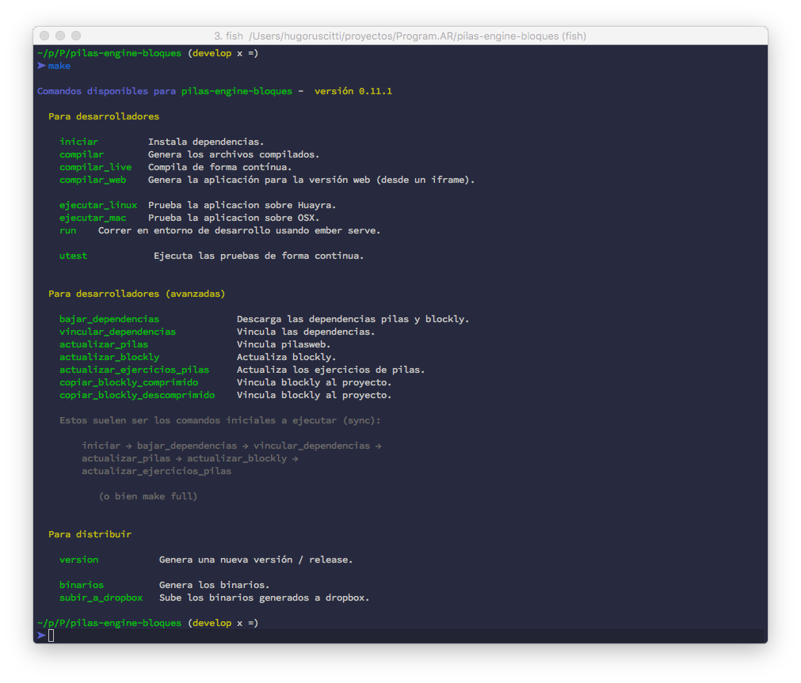

Pilas Bloques
=============

- Issues planificados para este sprint: [Stories in Ready](https://github.com/orgs/Program-AR/projects/1)

- Rama master: [](https://travis-ci.org/Program-AR/pilas-bloques)
- Rama develop (principal): [](https://travis-ci.org/Program-AR/pilas-bloques)

Esta es una versión hermana de [pilas-engine](http://www.pilas-engine.com.ar) pero
utilizando bloques, javascript y desafíos para aprender a programar.





¿Cómo empezar?
--------------

Generalmente, lo que se suele hacer inmeditamente después de clonar el repositorio es instalar lo necesario:

Para la dependencia node-gyp es necesario g++, si no lo tenés:
```
sudo apt-get install g++

```

Al igual que make:
```
sudo apt-get install make

```

Y lo mismo con python:
```
sudo apt install python

```
Y también hay que asegurarse de tener una version de node compatiuble con Pilas Bloques (>= 8):

Para lograrlo, podemos instalarlo ejecutando el siguiente script:
```
git clone https://github.com/nvm-sh/nvm.git ~/.nvm
source ~/.nvm/nvm.sh
source ~/.nvm/install.sh
```
Y luego elegir instalar la versión Long Term Support (LTS) mas actual de Node.js, actualmente lleva el nombre en clave Dubnium (Version 10.13.0).

```
nvm install lts/dubnium
nvm use lts/dubnium 

```

Luego, se puede escribir el comando ``make`` para ver las tareas disponibles:



Luego, para instalar las dependencias, compilar el módulo ejercicios_pilas y correr la aplicación, sencillamente:

```
make full
make serve
```

En general, para compilar diariamente, con `make serve` ya es suficiente.


Tests
-----

Para ejecutar los tests de la aplicación hay 3 opciones:

1. Levantar el server de test:

```
  make test
```

2. Ejecutar los tests de forma contínua:


```
  ember test --watch
```

De todas formas, aunque no ejecutes los tests en forma local, en este
proyecto estamos usando travis para que los test se ejecuten siempre
después de cada "push":

https://travis-ci.org/Program-AR/pilas-bloques


Notas de versión
---------

[acá](notasDeVersion.md)
